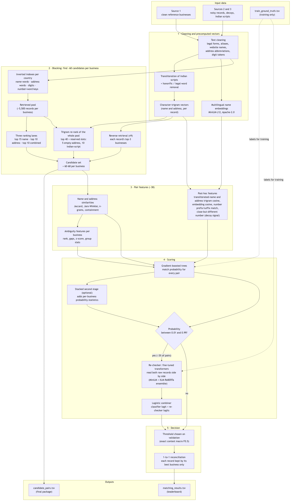
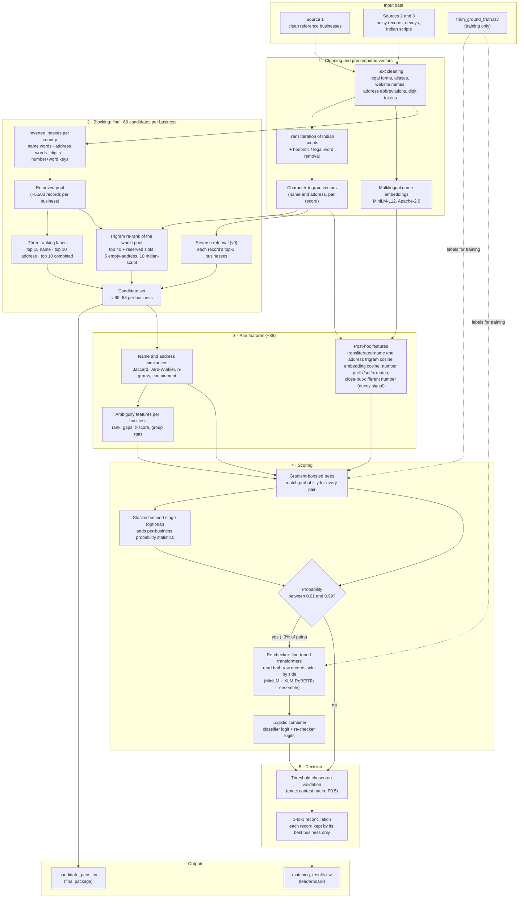
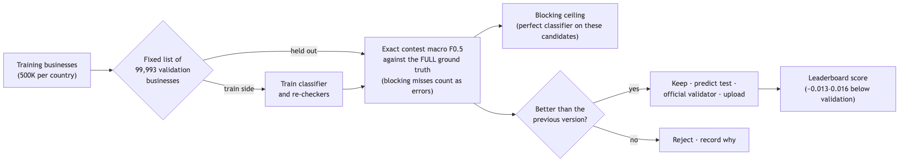
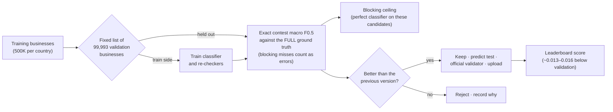

# Business Entity Resolution — Architecture

How our ML Challenge 2026 solution works, end to end: what each stage does, why it is built that way, and the measurements behind every decision.

---

## 1. The problem in one paragraph

We get business records from three sources. **Source 1** is a clean reference list (one row per business). **Sources 2 and 3** are noisy copies: typos, abbreviations, reordered words, missing addresses, names in Indian scripts, and deliberately planted **decoys**. For every Source-1 business we must list the Source-2/3 records that are the same business. The score is **macro F0.5 per Source-1 business**, which weights precision twice as much as recall, so a wrong merge hurts more than a missed one.

Scale: ~26 million records. Comparing every pair would be ~23 trillion comparisons, so the pipeline first narrows each business down to ~60 candidates, then a classifier decides.

---

## 2. Pipeline at a glance

### Full architecture diagram



<details><summary>Mermaid source (renders on GitHub)</summary>



</details>

### Validation loop (how every change is judged)



<details><summary>Mermaid source (renders on GitHub)</summary>



</details>

### Text version

```
raw TSVs
   │
   ▼
[1] Text cleaning ............ build_clean_cache.py + preprocessing.py
   │   names/addresses -> tokens, legal suffixes, digits, flags
   ▼
[2] Precomputed vectors ...... embeddings.py, posthoc_features.py
   │   multilingual name embeddings, character-trigram vectors
   │   (transliterated names, addresses)
   ▼
[3] Blocking (candidates) .... blocking.py (called by build_features.py)
   │   stage 1: inverted-index retrieval -> 3 ranking lanes
   │   stage 2: character-trigram re-rank of the whole pool
   │   ~57-68 candidates per business
   ▼
[4] Pair features ............ features.py, posthoc_features.py
   │   ~38 similarity / flag / ambiguity features per pair
   ▼
[5] Classifier ............... train_model.py (+ train_stacked.py)
   │   gradient-boosted trees -> match probability
   ▼
[5b] Re-checker .............. cross_encoder.py
   │   fine-tuned transformer reads both records' raw text,
   │   re-scores only the ~1.3% of pairs the classifier is unsure about
   ▼
[6] Decision ................. generate_predictions.py
   │   threshold + 1-to-1 reconciliation
   ▼
output/matching_results.tsv  +  output/candidate_pairs.tsv
```

---

## 3. Stage by stage

### 3.1 Text cleaning (`preprocessing.py`, `build_clean_cache.py`)

Runs once over all six source files and caches the result as Parquet.

| Step | Example |
|---|---|
| Lowercase, strip accents | `Société Générale` → `societe generale` |
| Remove legal forms anywhere in the name | `Memorial LLC Association` → core `{memorial, association}`, suffix `{llc}` |
| Alias constructs | `Ariagild formerly Industrial Staffing` → compare on the alias tail |
| Website-style names | `mkjindustries.com` → segmented with a word-frequency table built from our own Source-1 text |
| Address abbreviations | `rd` → `road`, `opp` → `opposite`, `rte` → `route` |
| Digit tokens (raw and leading-zero-normalised) | `0237` and `237` become the same token |

Indian-script text produces no Latin tokens here on purpose; it is handled by transliteration later.

### 3.2 Precomputed vectors

- **Multilingual name embeddings** (`paraphrase-multilingual-MiniLM-L12-v2`, Apache-2.0, 118M parameters). Each unique name is encoded once on the Apple GPU (~50 minutes for everything) and stored as float16.
- **Transliterated-name trigram vectors.** Indian-script names are converted to Latin with the rule-based `indic-transliteration` library, then cleaned: honorifics (`Sri`, `M/s`, `Mr`, ...) and legal words removed, trailing inherent vowel dropped (`silvara` → `silvar`), plus small per-script fixes (Tamil consonants, Bengali b/v, Malayalam chillu letters). Result: `यूनिक न्यू कंसल्टेंट्स लिमिटेड` → `yunik nyu kansaltents`, close to `unique new consultants`.
- **Address trigram vectors** from the cleaned address tokens.

Measured on 3,000 real cross-script true matches: cleaned transliteration clearly separates 62% of them from random pairs, versus 18.5% for the embedding. That is why transliteration drives blocking and the embedding is only one feature among many.

### 3.3 Blocking — finding candidates (`blocking.py`)

Blocking decides which records the classifier ever sees. **A match that is not a candidate can never be predicted**, so blocking recall caps the whole score. This was the biggest lesson of the project: fixing blocking moved the score far more than tuning the model.

Everything runs per country; countries are discovered from the data, so France (test-only) works automatically.

**Stage 1 — retrieval and three ranking lanes**

1. Inverted indexes on five token types: name words, address words, raw digits, normalised digits, and **number+word pairs** (`281|pune`). Each part of a pair is common on its own, the pair is specific; this recovers India records whose only usable signal is a sparse address.
2. Very common tokens are pruned; names made only of common words fall back to a multi-token intersection.
3. Everything sharing a token is the **pool** (median ~5,500 records per business).
4. From the pool keep the top 15 by **name** score, top 10 by **address** score, top 10 by **combined** score. Separate lanes exist because, in one combined ranking, neighbours sharing street/city/state words pushed out the exact-name match whose own address was empty.

**Stage 2 — re-rank the whole pool**

Every pool record is re-scored by cosine similarity of its (transliterated name + address) trigram vector against the Source-1 record; the top 40 are added. Trigrams tolerate typos (`Solutiros` ↔ `Solutions`) and partly bridge scripts. Reserved slots (v8): the best 5 **empty-address** records and the best 10 **Indian-script-name** records are also kept, ranked only against their own kind, because these can only ever score on half of the vector.

Ties are broken by record id, so candidate sets are identical run to run.

| Version | Recall US | Recall India | Candidates / business |
|---|---|---|---|
| v1: single ranking, top-100 | 84.8% | 79.7% | ~99 |
| v5: lanes + re-rank | 97.0% | 91.7% | ~57 |
| v7: + number+word keys | 97.9% | 93.5% | ~56 |
| v8: + reserved slots | 98.4% | 95.6% | ~60–68 |

### 3.4 Pair features (`features.py`, `posthoc_features.py`)

For each (Source-1, candidate) pair:

- **Name:** word Jaccard, containment both ways, Jaro-Winkler, character 3/4-gram Jaccard, length ratio, legal-suffix match and compatibility, generic-name fraction, transliterated-name trigram cosine, embedding cosine.
- **Address:** word Jaccard, digit Jaccard (raw and normalised), Jaro-Winkler, length ratio, empty flags, address trigram cosine.
- **House numbers** (added after error analysis):
  - `digit_affix_match` — one number is a prefix/suffix of the other (`157`/`57`, a dropped digit): seen in 16.5% of missed true matches vs 2.9% of hard non-matches.
  - `digit_near_conflict` — close but different numbers (`125` vs `128`), the signature of planted decoys: 32.8% of false merges vs 1.3% of true matches.
- **Record flags:** source 2 vs 3, alias, website, non-ASCII, blocking score.
- **Ambiguity (per business):** rank, gap to the next better/worse candidate, z-score, group size/mean/std, top score — so the model can prefer the best of several look-alikes.

Features computed "post hoc" are added to a finished table in one vectorised pass, so improving them never requires re-running blocking.

### 3.5 Classifier (`train_model.py`, `train_stacked.py`)

- **Model:** scikit-learn `HistGradientBoostingClassifier`, trained from scratch (learning rate 0.12, up to 127 leaves, early stopping). ~25 minutes on 56M pairs on a laptop.
- **Training data:** 500K Source-1 businesses per country and all their candidates, labelled from `train_ground_truth.tsv`.
- **Stacking (optional second stage):** a first model scores every pair; a second model also sees how each candidate's score compares with the other candidates of the same business (rank, gap to best, count above 0.5). First-stage scores on training rows come from folds the first model did not train on. Gain: about +0.002.

### 3.5b Re-checker — cross-encoder on uncertain pairs (`cross_encoder.py`)

The gradient-boosted model only sees hand-built similarity numbers. For the pairs it is unsure about (probability 0.05–0.95, about 1.3% of pairs), a transformer reads the two raw records side by side ("name | address" of each) and scores the pair directly. It can notice differences no feature was built for.

- **Base model:** `paraphrase-multilingual-MiniLM-L12-v2` (Apache-2.0, 118M parameters), fine-tuned as a pair classifier on the Apple GPU. An `xlm-roberta-base` version (MIT, 278M) is trained as a second, different re-checker for an ensemble.
- **Combining:** a small logistic regression takes the classifier's logit and each re-checker's logit; it weights the classifier and the MiniLM re-checker about equally.
- **Training data:** uncertain pairs from training businesses, never the validation ones.

Measured on all 99,993 validation businesses (v7):

| Re-checker training pairs | Validation F0.5 |
|---|---|
| none (v7 alone) | 0.9579 |
| 37K (first test, on half the validation set) | +0.0084 |
| 168K | **0.9707** (+0.0128) |

The gain grows with more training pairs, which is why larger runs are next. Both 2023 top teams also put a fine-tuned transformer at the centre of their solutions.

### 3.6 Decision (`generate_predictions.py`)

1. Keep pairs whose probability ≥ the threshold chosen on validation (~0.70).
2. **1-to-1 reconciliation:** every Source-2/3 record belongs to at most one business in the ground truth, so if a record clears the threshold for several businesses only the highest-probability one keeps it.
3. Write both output files; every Source-1 business gets a row (empty if no match).

---

## 4. How we measure (the part that mattered most)

- **Validation set:** a fixed list of 99,993 Source-1 businesses from training (`cache/val_entities.txt`), never trained on. Every version is scored on the same list, so numbers are directly comparable.
- **Metric:** exact contest macro F0.5, computed against the **full** ground truth. True matches that blocking never retrieved count as misses; singletons score 1 only if predicted empty.
  - Our first metric ignored blocking misses and reported 0.957 when the truth was 0.878. Fixing it redirected the project to blocking.
- **Blocking ceiling:** the score a perfect classifier would get on the candidates. It separates "blocking lost it" from "the model lost it".
- **Leaderboard gap:** validation has run ~0.013 above the public leaderboard on every upload so far (France is only in test), so validation predicts leaderboard scores.

### Results so far

| Version | Main change | Validation F0.5 | Blocking ceiling | Leaderboard |
|---|---|---|---|---|
| v1 | top-100 token blocking | 0.878 | 0.917 | 0.864 |
| v4 | three lanes, transliteration + embedding features, bigger model | 0.908 | 0.938 | — |
| v5 + stacking | two-stage re-rank | 0.9485 | 0.979 | **0.936** |
| v7 | number+word keys, house-number features, 2x data | 0.958 | 0.985 | pending |
| v7 + re-checker | fine-tuned MiniLM on uncertain pairs (168K) | **0.9707** | 0.985 | **0.955** |
| v8 + re-checker | reserved empty-address / Indian-script slots; re-checker on 500K pairs, band 0.01–0.99 | **0.9763** | 0.989 | **0.9685** |
| v8 | reserved empty-address / Indian-script slots | pending | ~0.989 (est.) | pending |

---

## 5. Ideas we tested and rejected (with the evidence)

| Idea | Result |
|---|---|
| Phonetic codes (Soundex/Metaphone) | recovered 0 of 55 real missed matches |
| Bigger single top-K cap (500) | 5x candidates for little recall |
| Per-bucket thresholds | 99% of businesses fell in one bucket |
| Post-processing rules ("predict top-1 if empty") | +0.0007 at best |
| Similarity to the business's best candidate | missed matches 0.73 vs hard non-matches 0.69 — no signal |
| Word-level name coverage | no separation in the uncertain band (40% vs 47%) |
| One-digit typo match for house numbers | more common in non-matches — would hurt |
| Fine-tuning Llama-3.1-8B | licence is not MIT/Apache; and blocking, not the classifier, was the bottleneck |

---

## 6. Rules we follow

- Only the provided data; no external lookups, APIs or geocoding.
- Legal-form lists, address abbreviations and transliteration rules are general linguistic knowledge, not business records.
- The only pretrained model is the Apache-2.0 multilingual MiniLM (118M parameters); the classifier is trained from scratch.
- No country is hard-coded; France is handled by the same code path.

---

## 7. Running it

From `code/business_entity_resolution/src/` (see that folder's `README.md` for details and timings):

```bash
python3 build_clean_cache.py
python3 embeddings.py
python3 build_features.py --split train --limit 500000 --lanes 15,10,10 --rerank-k 40 --rerank-extra 5,10 --workers 4
python3 train_model.py --max-iter 3000 --learning-rate 0.12 --max-leaf-nodes 127 --max-depth 16
python3 generate_predictions.py --lanes 15,10,10 --rerank-k 40 --rerank-extra 5,10 --workers 4
cd ../../.. && python3 utils/validate_submission.py --matching output/matching_results.tsv \
    --candidate output/candidate_pairs.tsv --test-dir dataset/test --check-ids
```

On a 64GB machine, run one heavy step at a time and keep `--workers` ≤ 4; memory, not CPU, is the limit.

---

## 8. File map

| File | Role |
|---|---|
| `src/preprocessing.py` | Cleaning rules, honorific pattern |
| `src/build_clean_cache.py` | Cleans all six files; invalidates derived caches |
| `src/embeddings.py` | Multilingual name embeddings + vectorised cosine |
| `src/posthoc_features.py` | Transliteration, trigram vectors, post-hoc features |
| `src/blocking.py` | Indexes, lanes, number+word keys, re-rank hook |
| `src/features.py` | Pair and ambiguity features |
| `src/build_features.py` | Blocking + features (+ labels, recall report) per split |
| `src/train_model.py` | Classifier, fixed validation split, threshold, ceiling |
| `src/train_stacked.py` | Second-stage stacked classifier |
| `src/cross_encoder.py` | Transformer re-checker for uncertain pairs (training, scoring, combiner) |
| `src/generate_predictions.py` | Test scoring, optional re-checker (`--cross-encoder`), reconciliation, output files |
| `utils/validate_submission.py` | Official format checker |
